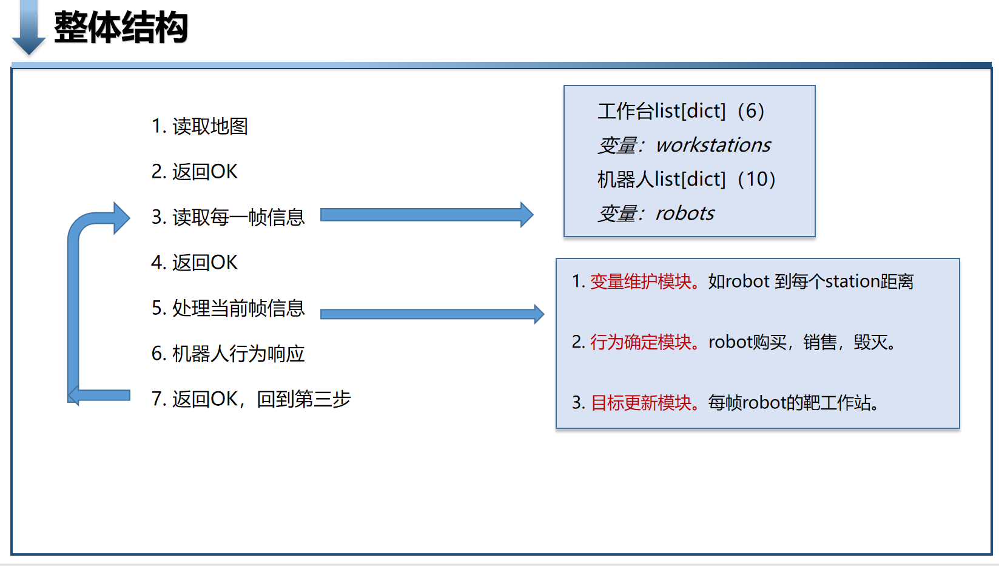
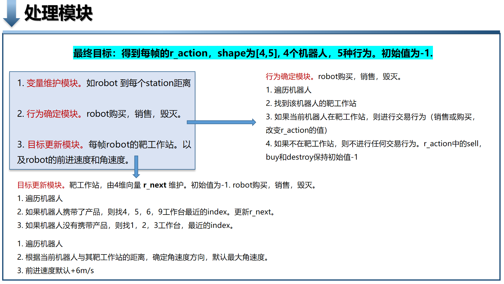
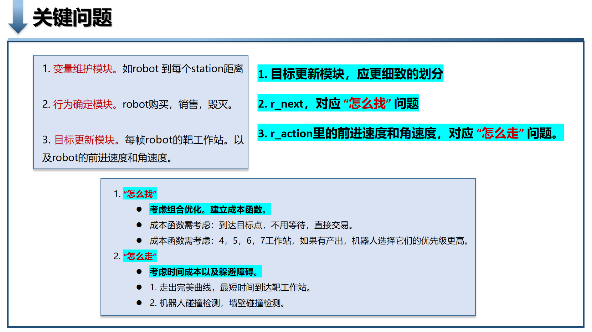

### Run
```python
# run
robot -m maps/1.txt "python main.py"

# Gui run
robot_gui -m maps/1.txt "python main.py"

# Add augument -f can change to fast mode
robot_gui -f -m maps/1.txt "python main.py"

``` 
### Problem
代码逻辑写好了，但跑起来有问题。搞到太晚了，明天再去找问题。

问题：不管是 robot.exe 还是 robot_gui.exe 运行，都无法一帧一帧调试，即查看每帧的代码输出。

### Solution Visual








